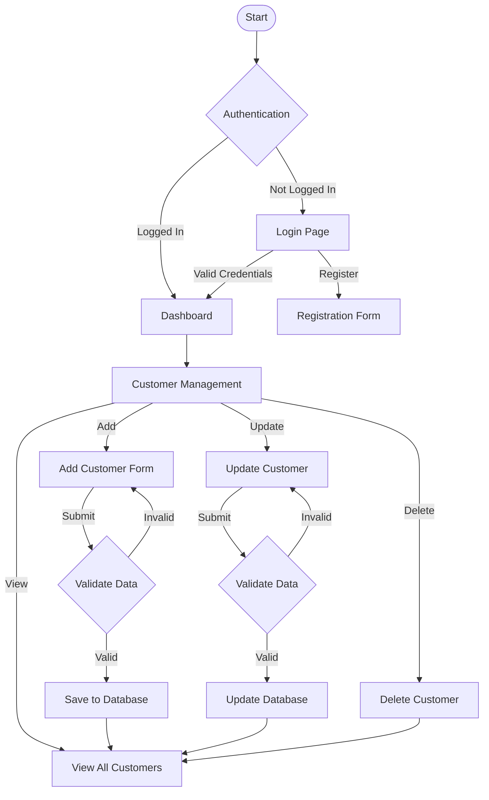
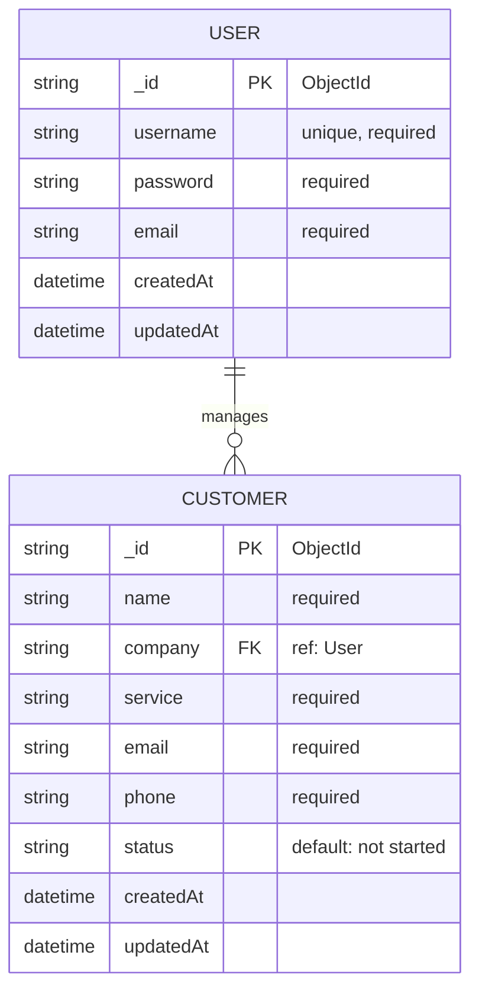

# Customer Relationship Management (CRM) System with Node.js and Express.js

## Prerequisites:
Node.js
Express
MongoDB
React
JavaScript

## Functionalities:
User Authentication and Authorization
Companies that want to use the CRM Portal can register on the application and access the functionalities by signing in.
JWT, JsonWebToken and bcryptjs are some packages used for implementing smooth authorization.
Context API helps to maintain the state of the user that has logged in.

## Adding Customers:
The company can easily add new customers and details about them.
A form is created with the post method to implement this functionality. Status can be selected from a drop down.
The page navigates to the all customers page when a customer is created.

## Customer Management:
Implementing functionalities to manage customer data such as name, email, phone number, and address. 
Allow users to add, view, update, and delete customer records.

# Lab 2

<code>[Посилання на коміт](https://github.com/PudchenkoAlexei/CRM/commit/3c6c8d3432909390c1a6431a749ab2278d3c9e64)</code>

# Lab 3

CRM System Flow Diagram

CRM System ER Diagram

